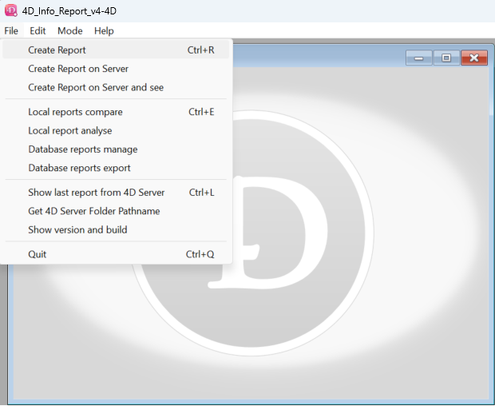
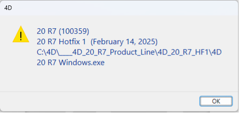
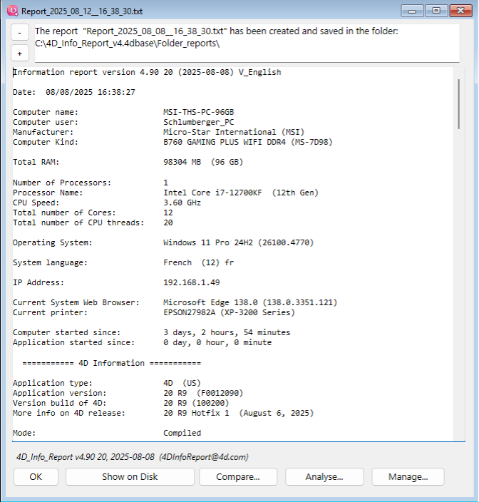
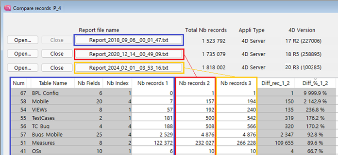
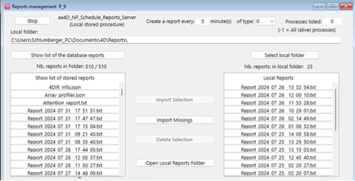
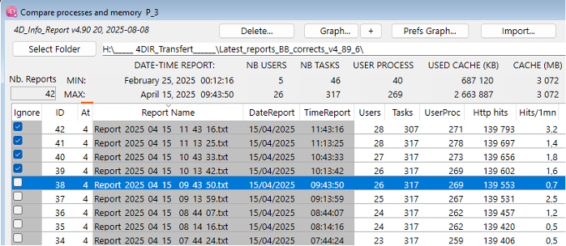
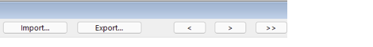
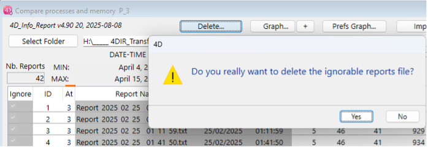

## Overview

This page documents standalone in the 4D_Info_Report reference.

## Discover the Component run in stand-Alone

(Opening directly the component database and creating once a requested data file).

---

### Using the custom menu when running in Stand-Alone, you can check how it works

**First section of the File menu:**

Creation of one report

- **Create Report** — executes the shared method `aa4D_NP_Util_CreateReport` (no parameter) *(Shortcut: Ctrl/Cmd r)*. After a few seconds, a new report is displayed in a dialog (see page 17).
- **Create Report on Server** (when executed on 4D in Remote mode) — executes the shared method `aa4D_NP_Util_CreateReport_Serv`, generating a new report on 4D Server (no warning on 4D Remote when the report is created). In local mode, behaves like Create Report.
- **Create Report on Server and See** (when executed on 4D in Remote mode) — executes the shared method `aa4D_M_Report_CreateOnServerSee` (no parameter), generating after a few seconds a new report on the Server and displayed in a dialog.

**Second section of the File menu:**

- **Local reports compare** — executes the shared method `aa4D_NP_Report_Compare_Display` that displays a dialog (see captures in next page) *(Shortcut: Ctrl/Cmd e)*
- **Local reports analyse** — executes the shared method `aa4D_NP_Report_Analyse_Display` that displays another dialog to compare 2 or 3 reports.
- **Database reports manage** — executes the shared method `aa4D_NP_Report_Manage_Display` that displays a new dialog to set the stored procedure, or import reports from 4D Server.
- **Database reports export** — executes the shared method `aa4D_NP_Report_Export_Display` that displays a new dialog to set criteria for reports to be compared in the reports main values, and also to import exported files (later at work).

**Third section of the File menu:**

- **Show last report from 4D Server** — executes the shared method *(Shortcut: Ctrl/Cmd l)* `aa4D_NP_Get_Last_Server_Report` that displays in an alert the last generated report on 4D Server (when executed on 4D in Remote mode), or on 4D in Stand-Alone mode.
- **Get 4D Server Folder Pathname** — displays in an alert the full path of the folder `Folder_reports` (located next to the (Host) data file). (As there is currently no way to change this location or the name of the current reports folder, no need to use a shared method to retrieve it: in your Host database code, just complete the parent Folder of the data file with `Folder_reports`.)
- **Show version and build** — executes the shared method `aa4D_M_Get_Build_4D_Text_call` that lets you select in a dialog a 4D or your built application, a plugin bundle or a Windows 4D product installer (as illustrated below), and displays in an alert:
	- the version of the file
	- the build number of the file (if it exists)
	- More info (public versions) corresponding to the build number and version
	- the full path of the selected file

---

Executing the shared method `aa4D_NP_Util_CreateReport` or `aa4D_M_Report_CreateOnServerSee`, after a few seconds (the first time), a new dialog is displayed including the generated report content:

---

When in Local mode, the **Show on Disk** button will open the content of the `Folder_reports`, with the last report selected. The upper part of the dialog indicates where the report created was saved.

When in Remote mode, if the report was not generated locally, then you can select a local folder to save the imported reports (via the **Save in Local Reports Folder** button). If this folder is not already set on 4D remote, a dialog will let you set one.

Two buttons: **-** and **+** allow to decrease/increase the font size of the report, also when focus is on the report area. Default is 12, or the one set in `4DIR_Preferences.json` (`Default_Report_FontSize`). The changed size of the font will be remembered for next display of a report until restart.

The **Analyse…** button will display a new dialog, allowing a simple comparison with one or two other reports (use the shared method `aa4D_NP_Report_Analyse_Display`).

---

Note: if a Diff_% value displays as “9999.9 %”, this means infinite diff (there was no record before).

The **Manage…** button will display a new dialog, allowing (in Remote mode) to import reports stored on 4D Server, and set the stored procedure that creates a new report every N minute(s) (Real):

---

When this dialog is displayed:

- If the stored procedure is not already started, a **Start** button is shown: click it to start the stored procedure on 4D Server (or 4D Stand-Alone), with the displayed settings.
- If already started, the button displayed will be **Stop**.
- To restart the stored procedure (with new settings for example), click the **Stop** button, and await that it changes to **Start** to click it.
- You can set a real value less than 1 minute, down to 12 seconds: enter `.2` (or `,2`) as the value in minute(s), for monitoring critical conditions.

The **Compare** button will display a new dialog, allowing to compare the main values of saved reports in this folder (same as when executing the shared method `aa4D_NP_Report_Compare_Display`).

When opening the component as a database, you can display this dialog via the menu of the Application window: File/Local reports compare.
As the dialog is opened in a new process, you can handle multiple folders at the same time.
Same dialog display when executing the shared method `aa4D_NP_Report_Compare_Display`.

---

If you click one or more **Ignore** checkbox, the corresponding report will be ignored in the MINIMUM and MAXIMUM values calculation, and also when choosing the **Graph...** button.

To modify many **Ignore** checkboxes at once, just set a selection of rows in the List Box and click one of the corresponding **Ignore** checkbox to invert the state in the selection.

You can also double-click one row of the List Box to open directly the report (if you have parsed a folder, or if the Import of the Blob was done without changing the location).

Next to the **Parse Folder** button, there is a text variable where you can input or paste the path of the folder to parse. You can also drop a folder (containing reports) over it to input the path name of this folder.

The **Parse Folder** button is used to select a folder containing reports created by the component.
If there is a valid folder path already entered next to the button, you will get this confirmation dialog:

> Do you want to select another report folder?

Clicking **Cancel** will force the parsing of the current folder, clicking **OK** will let you navigate to select another folder, and after confirmation of the selected folder, will parse this new folder.

When a folder is selected, a parsing of the reports inside this folder will populate arrays in the List box about the usage of the database.
If some reports contain **Attention :** items, the column **At** will show how many are found. If any is found in each report (in the Attention section), a red line is shown above the column.

The buttons **<**, **>** and **>>** allow to resize the width and height of the dialog.

---

---

The **Import** button allows to import a Blob generated via the **Export** button, that only contains the values used in the List Box.
It is much faster than processing all the reports again when there are many reports in the folder, and if the original folder is still in its original location, you will be able to open the reports via a double-click in the List box as if you have parsed the folder again.

The **Export** button allows you to select a format and a name to export the content of these arrays. You can for example:

- Generate a Blob (Compare Blob) that can be later imported to populate the List Box
- Generate an Excel document (.xml format compatible with Excel 2003 or later)
- Generate an XML document (.xml)
- Generate a text file document (.txt)

The first column of the list box (**Ignore**) is to select or not a list of reports for further action:
- update MIN & MAX
- include in the list of values that will be displayed in the Graph
- or delete these reports

Note that you can apply a check to a selection of lines: all will get the new value after a click.

The **Delete...** button is visible if at least one checkbox **Ignore** has been set:

**Attention:** If you click **Yes**, the reports with **Ignore** checkbox checked will be deleted from the parsed folder.
Note: this feature also works on 4D remote, as long as the location of the folder of reports is local (not on 4D Server).

There are two lines (**MIN** and **MAX**) above the List box: these 2 lines show the Minimum and Maximum values found in not ignored reports for each type of information.

<!-- NAV_BUTTONS_START -->
## Navigation

[Previous](./04_main_parameter.md) | [Summary](./01_introduction.md) | [Next](./06_pref_graph_svg.md)
<!-- NAV_BUTTONS_END -->
