# Explanations of the Pref Graph and SVG form 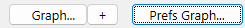

## Overview

This page documents Explanations of the Pref Graph and SVG form  in the 4D_Info_Report reference.

## Quick Navigation

- [Explanations of the Graph SVG dialog](#explanations-of-the-graph-svg-dialog)
- [Shortcuts](#shortcuts)
- [Hidden buttons in the Graph dialog](#hidden-buttons-in-the-graph-dialog)
- [Zoom in a selection of the Graph](#zoom-in-a-selection-of-the-graph)
- [Two groups of values displayed as polygons](#two-groups-of-values-displayed-as-polygons)
- [Save the main graph display as SVG](#save-the-main-graph-display-as-svg)
- [Display the content of a report](#display-the-content-of-a-report)
- [Open the corresponding report in a reduced window](#open-the-corresponding-report-in-a-reduced-window)
- [Display the main values with mouse-over](#display-the-main-values-with-mouse-over)
- [Scroll the graph](#scroll-the-graph)
- [Zoom in the graph without selection](#zoom-in-the-graph-without-selection)
- [Display the current Attention section](#display-the-current-attention-section)
- [View by 'Day' instead of the default view by 'Report'](#view-by-day-instead-of-the-default-view-by-report)
- [Highlight a specific polygon in the SVG Graph](#highlight-a-specific-polygon-in-the-svg-graph)
- [Remote access to reports](#remote-access-to-reports)
- [Error handling during report creation](#error-handling-during-report-creation)

The «Prefs Graph...» allows to set the default display settings of a graph: these settings can be stored on the computer, and will apply each time the component is used to display a graphic:

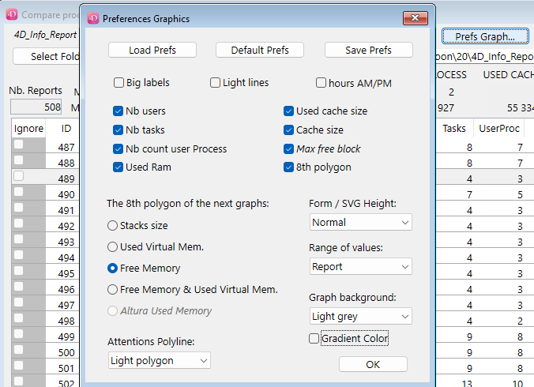

If the “8th polygon” is checked, choose what radio button correspond to your choice: it can be the Stack size (sum of the Stack size, default value) or another choice to display in the graph (as the eighth polygon) for example the variation of the Used Virtual Mem (Memory), or Free Memory (in RAM), or both.

Introduced in v4.70: “Attentions polyline” setting, to default the display of the Attention level when opening the SVG Graph (“Hidden polygon”, “Light polygon”, “Full polygon”).

Introduced in v4.71:

“Dark mode” also on PC, for the “Graph background”:, now integrated in v4.71, and a “Black mode” added for an even darker background. (also available on PC). New Check Box “Gradient Color” to apply a vertical gradient to the background color (except “Dark mode” and “Black mode”)

The “Graph...” button (Command/Crtl G) will display a new dialog with an SVG graph displaying the values of the arrays, or bring to front the currently displayed Graph SVG dialog.

(if less than two reports (not ignored) are listed in the List box, the “Graph…” button is invisible)

If you click this button with Shift down or Right-click, you force the display of a new Graph dialog.     Same with “+”. If Alt (Option on macOS) is down, this graph dialog will be condensed vertically.

Otherwise, if a related Graph dialog already exists for the compare dialog, it will be brought to front:

---

## Explanations of the Graph SVG dialog

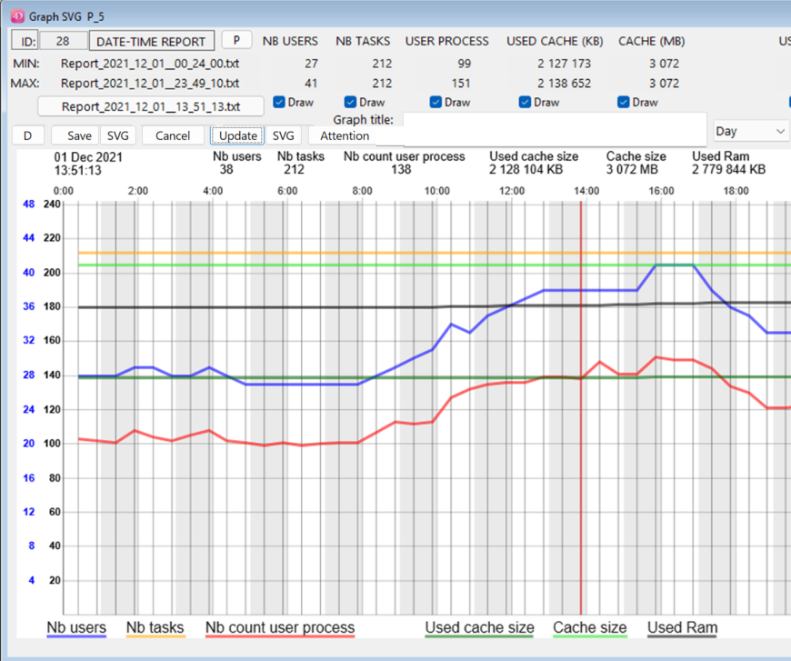

Click the «Draw» checkboxes to display or hide the polygon of the corresponding kind of values.

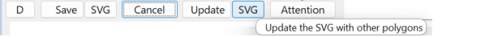

The button «Update», you will force the redraw of the SVG area. If a Graph title is entered (two lines allowed), it will be added in the top of the Graph. No current values will be displayed.

With a Shift down (or right-click) while clicking, you will rotate possible values for the 8th polygon:

Default: Stacks, or Used Virtual Memory, or Free Memory (see the Prefs Graph… settings, page 21).

If you click on the small button 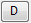 at the left of «Save», you will switch between different mode of display for the «Left» polygons, that is «Nb users», «Nb tasks», «Nb count user process».

When one of these checkboxes is checked, you can toggle the display for these three polygons:

When the button shows the letter «D» (default), if both Nb users and one of the two other checkboxes is checked, you will see a double mark (scale for users in blue, others in black) or a single mark for all.

When clicking this small button (or when using the shortcut «Command/Crtl G»), it will switch to single mark («S» : same scale for all) if not already the case, then will switch to «L» (Logarithmic scale), and then to «H» (hide (Left values) polygons). Next click returns to the default display («D»).

Here are the 3 (Big label limitation) or 4 kinds of display for the «Left» values:

If you see a separate blue Y series of values on the left, it corresponds to the value of the «Nb users».

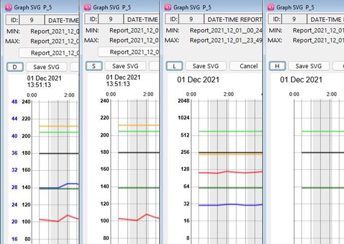

### Shortcuts

All shortcuts (new in v4.89.7, completed in v4.90), or click the Question mark button in the dialog:

- "Command/Crtl g": Switch the kind of display of the left scale of the graph
- "Command/Crtl d": Switch between the “Report” view and the “Day” view.
- "Command/Crtl f": Switch the level of display of the Attention thick pink polygon.
- "Command/Crtl r": Switch between the “Normal” and the “Mini” vertical size of the dialog.
- "Command/Crtl t": Put the focus in the Graph Title text area.
- "Command/Crtl p": Switch between the normal and light thickness of the polygons drawing.
- "Command/Crtl y": Switch between the values displayed as the 8th polygon
- "Command/Crtl l": (lowercase L) Switch between normal and big label for the vertical scales
- "Command/Crtl b": background of the graph gets darker (B to get it lighter)
- "Command/Crtl ?": (question mark) Display this dialog with the list of the shortcuts

### Hidden buttons in the Graph dialog

There are 4 hidden buttons in the Graph dialog:

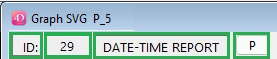

If you click in the rectangle surrounding “ID”, you will switch the size of labels and marks:

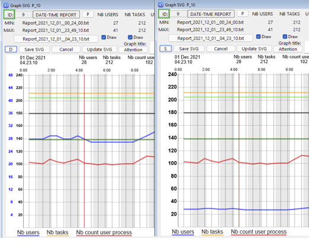

If you click the button “P”, you will switch the polygons thickness (regular / thin)

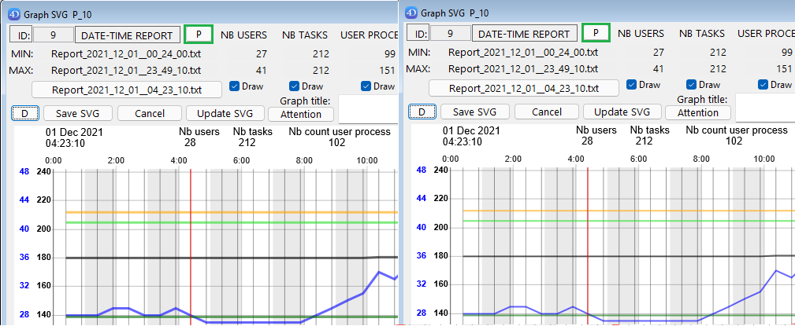

If you click in the rectangle surrounding “DATE-TIME REPORT:”, you will switch the vertical size of the Graph dialog, from Normal (with MIN and MAX values visible), to Small (condensed):

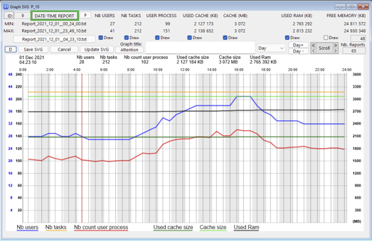

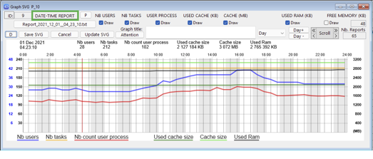

Note: this size switch via this button is convenient to force a proportional resizing of this window.

**If you click the invisible button between “ID:” and “DATE-TIME REPORT”**

(in this example, where is displayed “9”, the index of the current report selected in the graph), you will switch the SVG Background color, as via the Preferences Graphic” dialog:

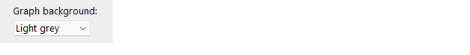

(default colour in the “Preferences Graphic” for the background is “White”).

### Zoom in a selection of the Graph

(Zoom is only available in the default view “Report” of the graph, not with “Day” view).

Click twice to set the left limit, and right-click (or Shift click) to set the right limit: the new selection will be highlighted briefly after the right-click,

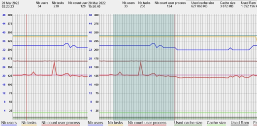

before the application of the display of the selected reports:

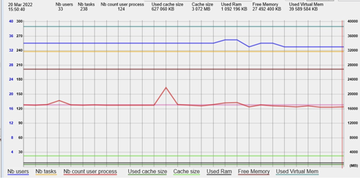

The Min and Max are recalculated, and the zoom applied. To un-zoom, hit the Delete key.

(you can cumulate zoom actions).

### Two groups of values displayed as polygons

- **the first ones (scaled on the left)** are related to: the number of users, tasks, and user processes.

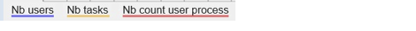

Depending on your choices and the max values, there will be one scale (for users only, in blue) and a common scale in black for the other two left values, or a common scale for these 3 values (see page 23 for more details on the left scales).

- **the second ones (on the right)** correspond to the memory usage, and are related to: the used cache size, the cache size, Used ram, Used Virtual mem, total stack size. (scaled in the right of the graph). The kind of values displayed depend by default to the settings in the Preferences Graphics panel, and also what checkboxes are selected (“Draw” checkboxes below their respective labels):

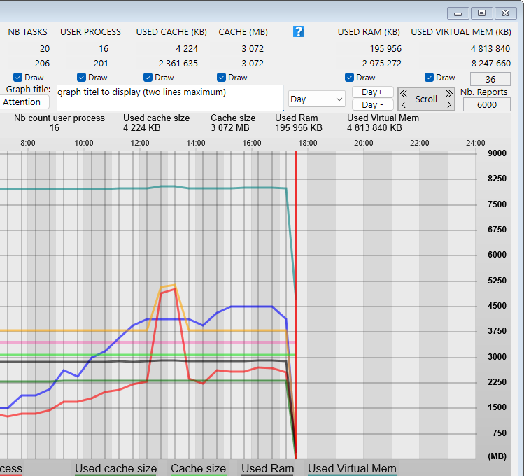

### Save the main graph display as SVG

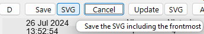

Click the “Save” button, you will save the graph in an SVG document, after setting the name of the document and selecting where the document will be stored.

Click the following “SVG” button, to also include the current values or Attention section.

### Display the content of a report

If you click in the graph, the nearest report will be highlighted, and the values of this report will be displayed in the top of the graph: then just move the mouse X on the left or the right to get these values updated.

If the vertical line is red, there is at least one attention in the report, otherwise the line is blue.

When a report is selected via a mouse over, the name is displayed as the title of a button, and the index of the report in the selection is displayed next to the ID.

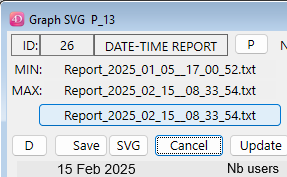

### Open the corresponding report in a reduced window

Click the button containing its name

or

Double-click in the graph the highlighted corresponding report:

(same result as a double-click in one of the lines of the List box in the Compare dialog)

A reduced windows with the report content will be displayed.

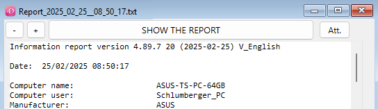

If you click “SHOW THE REPORT”, the report file will be selected in your disk.

(if “SAVE THE REPORT” is displayed, you can load and save locally the file from the Server).

If the button “Att.” is enabled (at least one Attention raised), a click on it will display over a new window with the content of the Attention section.

### Display the main values with mouse-over

While the horizontal position of your mouse is over the graphic with the polygon (between the scales), the corresponding main values of the report are displayed on top of the graph, including the short date and time.

If the mouse is over the name of a polygon below the graph, see page 32 for some explanation.

Precise selection of a report in the graph: To be sure to move to each report next to the blue (or red) vertical line, you can use the Keyboard Left Arrow Key or the Right Arrow key.

Note: to escape this Mouse over mode, move the X position left or right of the graph part displaying the polygons, or above the graph.

### Scroll the graph

Scrolling the graph (in the “Report” mode only, not in “Day” mode)

Mouse over one of the four arrow sections in the top of the dialog.

(Double arrow sign will speed-up the scroll compared to single arrow sign).

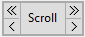

### Zoom in the graph without selection

Zooming in the graph without selection (in the “Report” mode only, not in “Day” mode).

(in “Day” mode, “Zx” labels are replaced by “Day” labels)

With these two buttons, you can increase or decrease the scale of the X values.

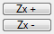

- with Zx +, you will scale the X values up to ratio 256

- with Zx -, you will scale down the X values to a quarter of the default scale:

(clicking again this button will switch the scale to half, quarter and scale 1).

You can also scale up or down via the keyboard Up Arrow Key and Down Arrow Key.

### Display the current Attention section

(«Command/Crtl F»: Switch the level of display of the Attention polygon.)

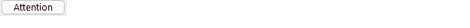

If the button «Attention» is enabled (at least one report has an Attention item), you can click once to get a pale pink polygon,

The vertical step show the number of Attention item found in the Attention section of each report.

If you click another time, this new polygon will appear darker, and other polygons will be dimmed.

(If you click again another time, this Attention polygon will be hidden).

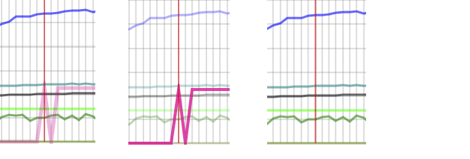

The content of the Attention section is also displayed in the Graph:

When moving the mouse over reports in this mode, if there is at least one Attention, you will get the detail of the Attention section displayed on top of the SVG graph (at the opposite side)

This text is drawn over a background rectangle (with some transparency)

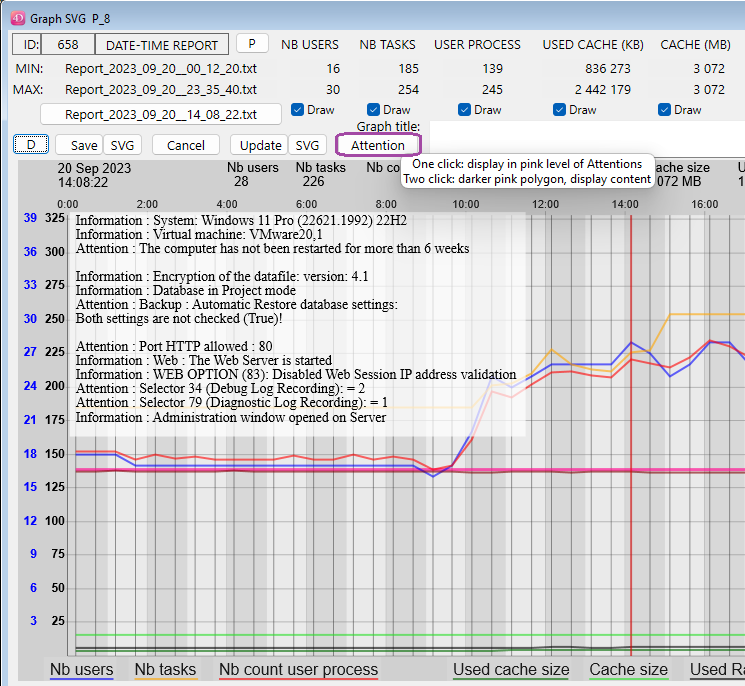

If the background color is a light yellow, it means that the content of the Attention section changed compared to the Attention section of the previous existing report, otherwise it is white.

(With Dark or Black background setting, of course the Attention section is in lighter grey mode.)

The dynamic display of the Attention section avoids the need to open the related report to check its content. Once this content is displayed, you can click again the Attention button to change the display of the other polygons.

### View by 'Day' instead of the default view by 'Report'

(also set via the Prefs Graph…)

If in the pop-up (at the left of the zoom Zx buttons) if you choose 'Day', a day view will be displayed.

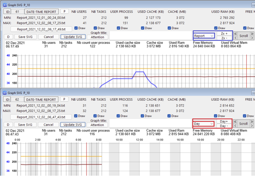

This 'Day' view will be scaled for X values on the 24 hours of the current selected day.

Alternate vertical background will mark each hour of the day.

If a current report was selected in the 'Report' view before switching to the 'Day' view, then the daily reports will correspond to the current day of this selected report.

(if no report was selected, the day of the last report will be displayed).

When “Day” is selected, you can now navigate to previous or next day (if it exists):

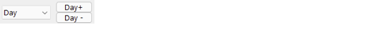

(the “Z+” and “Z-” buttons labels are replaced with “Day+” and “Day-”)

(if when clicking, you shift down, you will move to the next or previous week same calendar day).

You can switch back to the 'Report' view (where you will be able to scroll).

The highlighted report should remain the same when switching the view.

### Highlight a specific polygon in the SVG Graph

A Graph with many polygons displayed and many values reported might be difficult to read.

If you want to pay attention to a particular set of values (users, cache, memory), it is now easy to highlight the specific polygon without de-activating the display of other polygons (via uncheck of their Draw checkbox).

With your mouse, just mouse over the label of your choice, in this example “Nb Users”:

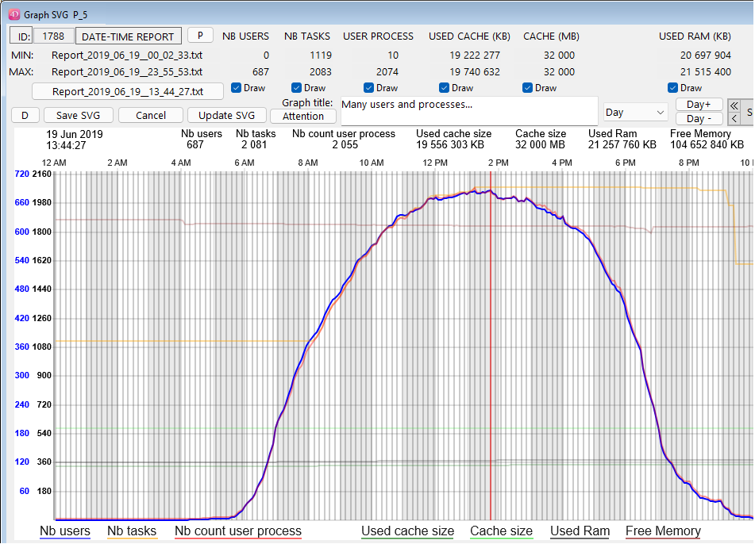

The selected polygon of the corresponding label with get the most Opacity to be the most visible, and the related other values (in this case “Nb tasks” and “Nb count user process”) will also get la lighter opacity.

All other displayed polygons will be more transparent to ease the readability.

To leave this mode (back to normal display), just move the mouse lower than a label once.

If the requested reports include the daily reports from the Server, a new checkbox 'Live update' will appear on the Compare dialog (in Remote mode):

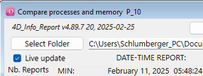

If the stored procedure creating reports is started on the Server, if you click the checkbox, the new created reports values will be added to the current list of values.

If you open a Graph dialog from this Compare dialog, it will also complete the polygons with the created reports. (you can also auto complete the graph when in the 'Day' view) with each new created report, that will complete the List box and/or the SVG Graph.

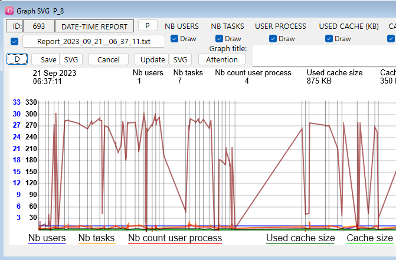

Reminder about the updated buttons in the Compare dialogs in v4.70 (also reminded in help tips):

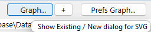

(the “+” button next to “Graph…” is to display a Graph dialog in a new process with the last prefs)

### Remote access to reports

(and values shown in the List box of the Compare dialog)

A dialog is available (also in Remote mode), via the method «aa4D_NP_Report_Export_Display» *                 (or the menu “File / Database reports export” when the component is opened directly)

If there is one menu item (for access to “4D_Info_Report” for administrators) that you implement in your Host database, we recommend that it executes a simple method like this:

```4d
ARRAY TEXT($at_Components;0)
COMPONENT LIST($at_Components)
If (Find in array($at_Components; "4D_Info_Report@")>0) // If the component is recognized
	// to display this dialog of the component:
	EXECUTE METHOD(«aa4D_NP_Report_Export_Display»)
End if
```

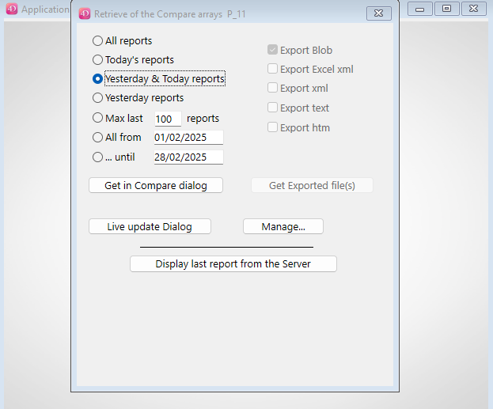

After selecting (or entering) your criteria in the Top/Left part of this dialog, if you click the button

“Get in Compare dialog”, a new dialog will display the values retrieved from the 4D Server, similar to the one displayed via «aa4D_NP_Report_Compare_Display». From this new dialog, you will be able to sort the values displayed in the List box, or display a SVG Graph.

If you click the “Manage…” button, you will access the Manage dialog, to start or stop the stored procedure, or import reports from 4D Server.

Below “Get in Compare dialog”, there is this button: “Live update dialog”.

If you click this button, you will directly get the Compare dialog with the next reports from the stored procedure. If this stored procedure is not activated, it will be by clicking this button, creating regular reports every 12 seconds.

In the compare dialog, the “Live update” checkbox will be checked directly.

(Remind to stop the stored procedure when you no more need it via the “Manage” button).

If you click the button “Display last report from the Server”, the last report created (on the Server if the dialog is displayed in remote mode) will be searched and displayed.

It will be the last created local report displayed when in Stand-alone mode.

If no report was created by the component already, nothing will happen.

### Error handling during report creation

The creation of reports can handle some errors:

If (for example) you have started the stored procedure to create reports every N minute on the Server, and the current folder where the new reports are saved is no more available:

- The component will automatically create a new folder in the “4D_Info_Report_Prefs” folder of your computer (this is where are stored some preferences and scripts of the component).

(It will also recreate the Array_profiler.json, like during the creation of the first report after the restart of 4D or 4D Server):

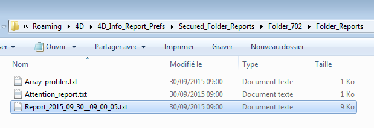

So with this version, if for any reason the «Folder_reports» (by default next to the Data file) is no more available, Check if there is a folder named «Secured_Folder_reports» in the Temp folder.

If this folder exists, check what is the latest created folder inside:

(These created sub folders are named «Folder_' followed by a random number between 100 and 900)

Inside this sub folder, there is a unique «Folder_reports» that contains the last created reports.

If the folder containing your created reports is no more available:

Attention : Your folder ‘Folder_reports' was no more available !

({your current location}\Folder_reports\)

A ‘Folder_reports' was created and is now used in the 4D_Info_Report_Prefs folder :

(C:\Users\{currentuser}\AppData\Roaming\4D\4D_Info_Report_Prefs\Secured_Folder_reports\Folder_702\Folder_reports\)

If you have set another volume for the folder to contain the report

(via the shared method: aa4D_M_Folder_Rep_SetPath_local)

and this volume is by accident disconnected, the reports will still be created (in this new folder).

Also tested, the access of the Data file: if there is an error accessing the volume or the Data file itself, a new Attention will be created in the current report. The component will try again to access it when creating the next report.

The Attention_report.txt is created or updated when:

There is a new content of the Attention section in the last created report, with at least one Attention raised, not just Information line(s).

Example of a content of the Attention_report.txt:

```text
Creation: 2025_08_28__12_37_23  V_English

Information : Operating System: Windows 11 Pro 24H2 (26100.4652)
Information : Virtual machine: VMware20,1
Attention : The computer has not been restarted for more than 7 weeks

Information : Encryption of the datafile: version: 4.1
Information : Database in Binary mode

Attention : Backup : Automatic Restore database settings:
Both settings are not checked (True)!

Attention : Security risk : Port HTTP allowed : 80
Information : Web : The Web Server is started
Information : WEB OPTION (83): Disabled  Web Session IP address validation
Information : Selector 44 (SQL Engine Case Sensitivity):  = 1
Attention : Selector 34 (Debug Log Recording):  = 3
Attention : Selector 79 (Diagnostic Log Recording):  = 1
Information : Administration window opened on Server

(Raised information there cannot compensate for an in-depth analysis)
```

---

Note: Location of the folder “4D_Info_Report_Prefs” (in Get 4D folder(Active 4D Folder) :

On Windows: C:\{Users}\{User name}\AppData\Roaming\4D\4D_Info_Report_Prefs

On macOS: {System volume}:{Users}:{User name}:Library:Application Support:

4D:4D_Info_Report_Prefs

<!-- NAV_BUTTONS_START -->
## Navigation

[Previous](./05_standalone.md) | [Summary](./01_introduction.md) | [Next](./07_format_content.md)
<!-- NAV_BUTTONS_END -->
