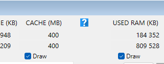
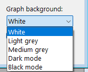
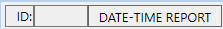
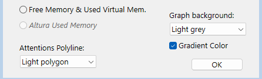
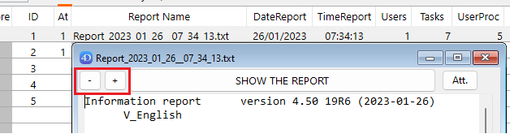
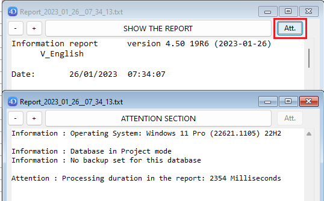
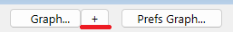
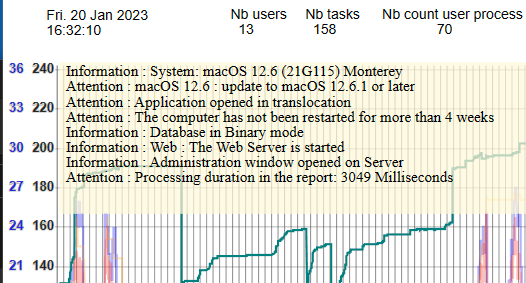
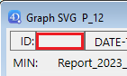

# Last implementations/changes

## Navigation rapide

- [Version 4.90](#version-490)
- [Version 4.80](#version-480)
- [Version 4.7x](#version-47x)
- [Version 4.60](#version-460)
- [Version 4.50](#version-450)
- [Version 4.40](#version-440)

## Version 4.90

> [!NOTE]
> Lecture guide: Nouveautés | Compatibilité | Méthodes

### 4DIR_Preferences.json file (two new selectors, with default value false)

- « .anonymizePublicIP_Name »

When this selector is set to true:

- If the IP of the computer is public:, instead of the real IPv4, you get:

- IP Address:                    	(anonymized Public IP)

- instead of the Current system user name, you get:

- Computer user:                 	(anonymized Current user)

- « .anonymizePublicIP_Name »

- If you set this Key to True, when parsing folder of reports, no checking and fix of the parsed report will apply: this will really speed-up the parsing of a large large folder of reports.

- Same speed effect will apply if you keep the Shift button down  after selecting the folder to parse.

> Note: when a report is opened (also via a double-click in the Compare or the Graph dialog),

The corrections applied to the report is always saved in the file (with same date and time)

New shortcuts in the File menu (when run in Stand-Alone) and others

- (See the deployed File menu in page 15)

- In the compare dialog: a new shortcut for the Graph button: (Cmmand/Crtl G).

- In the graph dialog:

- A new square icon with a question mark (?)



> (Ctrl/Cmd ? to activate it, to display the list of available shortcuts)

- 20 R9 Hotfix 1 identified.

- New shortcuts in the Graph dialog:

- Cmd/Crtl b: (lowercase B) increase darkness of the graph background

- Cmd/Crtl B: (Uppercase B) decrease darkness of the graph background

Already in v4.89.25

Improved Backup information handling

If a “/Settings/backup.4DSettings” is next to the Data file, it is now tested first and parsed.

Compatibility* the macOS 26 (Tahoe) since beta 3

Compatibility* the 20 R10 (and 4D 21 when available)

Handling of missing activated wmic (like with a fresh install of Windows 11)
(* at this current date)

---

## Version 4.80

> [!NOTE]
> Lecture guide: Nouveautés | Compatibilité | Méthodes

### with v4.89.7

In Complement to the exiting shortcut in the Graph dialog:

- «Command/Crtl g»: Switch the kind of display of the left scale of the graph

New shortcuts added

- «Command/Crtl d»: Switch between the “Report” view and the “Day” view.

- «Command/Crtl f»: Switch the level of display of the Attention thick pink polygon.

- «Command/Crtl r»: Switch between the “Normal” and the “Mini” vertical size of the dialog.

- «Command/Crtl t»: Put the focus in the Graph Title text area.

- «Command/Crtl p»: Switch between the normal and light thickness of the polygons drawing.

- «Command/Crtl y»: Switch between the value displayed as the 8th polygon

- «Command/Crtl l»: (lowercase L) Switch normal and big label for the vertical scales

- «Command/Crtl b»: Added in v4.90, to change the background darkness

- «Command/Crtl ?»: Display in a separate dialog the list of these shortcuts.

### with v4.89

- Completed macOS model identifiers: (reports, Array_profiler.json)

All new mac models of 2025 until end of July are identified with a completed model name: for example, “Mac16,11” is completed as “Mac16,11 _Mac mini (2024, M4 Pro)”

Starting with v4.82, the updates of the components are available via Github:

<https://github.com/4d/4D_Info_Report>

The old historic link reserved to Partners also redirect to Github:

<https://taow.4d.com/Tool-4D-Info-Report/PS.1938271.en.html>

Improved handling of the limitation of reports

When a limitation of the number of reports is set via the shared method aa4D_NP_Reports_Max_Set_Limit. New: any new limit will be handled after each new report created

A new pre-emptive Worker handles the limitation of the reports (delete oldest reports): “4DIReport_W_Limit_MaxReports”.

This Worker can now delete as much as 500 oldest reports (after the creation of a second report)

---

## Version 4.7x

> [!NOTE]
> Lecture guide: Nouveautés | Compatibilité | Méthodes

### More options for the Graph display:

Via the button “Prefs Graph…” of the Compare dialog:

- Added background color for the SVG Graph (also available on Windows)



Note: you can also alternate them in the Graph dialog by clicking the rectangle between the “ID:” and “DATE-TIME REPORT”. By default, a click will use the following darker background. use Shift Key for reverse



- Added Setting for the display of the “Attention” polygon by default. ‘Light’ setting is most convenient

- Added checkbox “Gradient Color” to apply a vertical gradient (ignored in Dark or Black mode).



---

## Version 4.60

> [!NOTE]
> Lecture guide: Nouveautés | Compatibilité | Méthodes

### aa4D_M_StoredProc_frequency_Set (preemptive, invisible)

aa4D_NP_Util_CreateReport_Serv ({Frequency}; {ContentMode}; {CommentPointer}; {Nb processes list})

#### Description

The aa4D_NP_Util_CreateReport_Serv command is very similar to the aa4D_NP_Util_CreateReport command.

The only difference is that it will create the report on 4D Server when executed in Remote application.

#### Description

The aa4D_M_StoredProc_frequency_set returns the current value of the delay between the creation of reports in the Stored procedure:

If the real value returned = 0 : the Stored procedure is not running (on the Server)

If the real value returned > 0 : the Stored procedure is running (on the Server), with the value as minute(s). This value might be different than an integer value: 0.25 (or 0,25) equal 15 seconds

(Can replace the older v4.20 shared method “aa4D_M_Schedule_Reports_Info” that was not preemptive.)

### aa4D_M_StoredProc_frequency_Get (preemptive, invisible)

#### aa4D_M_StoredProc_frequency_Get

#### Description

The aa4D_M_StoredProc_frequency_set returns the current value of the delay between the creation of reports in the Stored procedure:

If the real value returned = 0 : the Stored procedure is not running (on the Server)

If the real value returned > 0 : the Stored procedure is running (on the Server), with the value as minute(s). This value might be different than an integer value: 0.25 (or 0,25) equal 15 seconds

(Can replace the older v4.20 shared method “aa4D_M_Schedule_Reports_Info” that was not preemptive.)

Completed macOS model identifiers: (reports, Array_profiler)  (since v4.53)

if model is only identified as “MacX,Y”, the family model will be added after " _"
for all mac models handled, the year of the model, the processor, and screen size* complete the description (*If applicable).

for example:
“MacPro 7,1” will be identified as "Mac Pro 7,1 _ (2019, Xeon)
“Macmini 9,1” will be identified as "Mac mini 9,1 _ (2020, M1)
“Mac 14,15” will be identified as "Mac 14,15 _MacBook Air (2023, M2, 15’)
“Mac 14,14” will be identified as “Mac 14.14 _Mac Studio (2023, M2 Max)”
“Mac 14,12” will be identified as “Mac 14.12 _Mac mini (2023, M2 Pro)”
“Mac 14,6” will be identified as “Mac 14.6 _MacBook Pro (2023, M2 Max, 16’)”

The Year of the model and the model info can be useful to identify for example what (older) mac models are not compatible with Sonoma, like this one: iMac18,3 _ (2017, i7,  27')

(not all  mac computers are identified, but many Mac Pro, Desktop and Laptop are).

---

## Version 4.50

> [!NOTE]
> Lecture guide: Nouveautés | Compatibilité | Méthodes

### INTERFACE (New in 4.50):

#### 1/ Zoom buttons (and changed font under Windows: Consolas for proportional font)

- In the dialog displayed after creating a report, there are now two buttons (“-” and “+”) to decrease/increase the font size of the report area (see page 17)

- These buttons are also visible when you open an existing report (double-click inside the List box of the compare dialog or the Graph area)



#### 2/ Attention button (“Att.”)

- If there is at least one Attention detected in the report, a button “Att.” is also enabled (top right)

- If you click on this button, a new window will display the content of the Attention section:



(notice that in s example, the zoom factor has been changed in the frontmost dialog).

#### 3/ Doubled buttons (to allow a click without Right-click):

- In the “Compare” dialogs (when there is more than one report listed):



- There is a new button at the right of the “Graph…” button: “ + ”

- When clicking on it, there is a New process displaying a Graph dialog, even if there is already one linked to the Compare dialog process.

- In the “Graph” dialogs:

- There are two new buttons “SVG” after existing buttons:


- The first one (“SVG” next to the “Save” button) will include in the saved .svg file the interacted display of the Graph:



The second one (“SVG” next to the “Update” button) will alternate the display of the right polygons.

These two buttons behave as if you use the Shift Key while clicking, as before.

They are more convenient when using a Touch screen, or when just using a mouse.

You can alternate the white or grey background of the graph:

Click the (empty or filled) rectangle next to the ID rectangle to alternate the background



---

## Version 4.50

> [!NOTE]
> Lecture guide: Nouveautés | Compatibilité | Méthodes

### 4DIR_Preferences.json file (New in 4.50):

This new file is in the “Resources” folder of the component, and can be removed (not suggested) and is also used by 4D Server when creating new reports.

It has these default values:

```text

{

Use_LF_for_end_of_line: true

Dont_add_a_BOM: true

Default_FolderReportsName: «Folder_reports»

Default_Report_FontSize: 12

}

```

Use_LF_for_end_of_line and Dont_add_a_BOM: true is set by default

You can change them if you need it (false instead of true to get back to the original reports text, that include a BOM and end lines with CR/LF), but keeping the default true value will save one Byte per line (and 3 Byte in header of the files):

This reduction of the size of the Reports is significant with many lines.

If the file “4DIR_Preferences.json” is removed (or the Key removed/renamed), the new reports will keep their historical format: BOM (UTF-8) and CR/LF at the end of each line.

Default_FolderReportsName: «Folder_reports»

You can set your own default folder name, that will be used if the default name “Folder_reports” is not found next to the Data file (or if the default path name of the folder if not set via the shared method:

aa4D_M_Folder_Rep_SetPath_local)

Default_Report_FontSize: 12

This is the default font size that will be applied at the opening of the component (with Host database or not). It is applied to the area of the report when you create and display a report, or when you open a report.

You can decrease the default font size down to size 10, and up to size 18.

As this default size is applied to all users of the component, you can overwrite this preference, by setting your own preferred size in the same key in your local file: “4DIR_General_Prefs.json”.

(Method aa4D_M_Show_Preferences to access this local file.)

For example, if you use the component in Stand-alone to analyse a folder of reports, and you are using a large screen, you can set this value size to 16 in your “4DIR_General_Prefs.json”.

All new Window displaying a report will use this default size.

As explained page 46, you can increase/decrease the default size for the session, via the “-” and “+” Buttons, or when the focus is inside the report area.

The last current size will be applied for all new window displaying a report until you quit 4D.

Array_profiler.json file (completed in v4.47 and v4.50):

(reminder, this file is replacing the historical text file Array_profiler.txt since v4.40)

```text

{

Manufacturer: “ASUS”

Model_Identifier: “PRIME X299-A”

Memory: “65536”

System_version: “Windows 11 Pro (26100.3194) 24H2”

Number_of_Processors: “1”

Processor_Name: “Intel Core i7-7820X”

CPU_Speed: “3.60 GHz”,

Total_Number_Of_Cores: “8”

Total_number_of_CPU_threads: “16”

System_Web_browser: “Microsoft Edge 133.0 (133.0.3065.82)”

Internal_build_4D: “20 R7 (100359)”

More_info_on_4D_release: "20 R7 Hotfix 1  (February 14, 2025)"

Application_type: “4D Server” // <=== NEW in v4.47

Date_modified: “2025-02-24” // <=== NEW in v4.47

TLSEnabled: false

useLegacyNetworkLayer: false

volumeShadowCopyStatus: “Available”

headless: false,

Launched_As_Service: false

Other_4DServer_Run_as_Service: “Total: 15”

Product_version: “20250221_20R7 (100359)” // <=== Now a separate and renamed property.

File_Description: “(My_Server_Application)”, // <=== NEW in v4.47

Copyright: “(My_Copyright)” // <=== NEW in v4.47

"Host_compiled_mode": true,

"Application_pid": 18168,

"Project_mode": true,

"4DIR_Component_version": "4.89.7 20 (2025-02-25)",

This_file_creation_date: «2025-02-15», // <=== NEW in v4.50

Computer_started_since: «8 days, 7 hours, 25 minutes» // <=== NEW in v4.50

Application_started_since: «0 day, 0 hour, 0 minute» // <=== NEW in v4.50

«ProcessesInfoList»: [  // <=== NEW in v4.50 (v18/v19, use a variant for $1) // see note below

{

«name»: «SentinelAgent.exe»,

«pid»: 12728

}

]

}

```

- If a file «ProcessesToListServer.txt» is in the “Resources” folder of the component, and contains “[SentinelAgent]” :  When creating the first report, this method will search all processes with a name beginning with “SentinelAgent” in this example.

To prevent any execution of the method (as it might consume few seconds to execute), just let in this file the default content: “[STOP]”.

This collection will also be returned when calling the shared method: aa4D_M_RunningProcesses2Search, with or without argument.

See documentation of this new shared method aa4D_M_RunningProcesses2Search

next page.

---

## Version 4.50

> [!NOTE]
> Lecture guide: Nouveautés | Compatibilité | Méthodes

### New shared method: aa4D_M_RunningProcesses2Search

#### aa4D_M_RunningProcesses2Search

#### Description

The aa4D_M_RunningProcesses2Search  search every process running on the computer whose name begins with each name listed as parameter:

If there is a file inside the Resources folder of the component named «ProcessesToListServer.txt»,

You don’t need to pass a parameter to search: the list will be inside the document, formatted as a collection.

If this file contains “[STOP]”, you prevent the use of this shared method.

See the example in the previous page.

---

## Version 4.40

> [!NOTE]
> Lecture guide: Nouveautés | Compatibilité | Méthodes

* available for 4D 18, 4D 19 (->19R5) and another one for v19R6 (and later):

- Array_profiler.txt has been replaced by Array_profiler.json (easier to parse by code)

- (in label names, “ ”  are replaced by “_” to be able to address directly the content.

- There is a new information section (above the Attention section):

- ----- Get database measure (average per minute since previous report) -----

- Cache ReadBytes:     10 230 KB

- Cache MissBytes:        127 KB

- Disk ReadBytes:       9 327 KB

- Disk WriteBytes:       3615 KB

<!-- NAV_BUTTONS_START -->
## Navigation

[Previous](./07_format_content.md) | [Summary](./01_introduction.md) | [Next](./09_deployment.md)
<!-- NAV_BUTTONS_END -->
