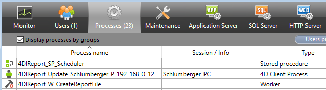

# Deployment of the component

## Overview

Deployment guidance and host integration details for the 4D_Info_Report component.

## Quick Navigation

- [Host code access](#host-code-access)
- [Hard-link-free example](#hard-link-free-example)
- [Host template](#host-template)
- [French interface example](#french-interface-example)
- [Local preferences](#local-preferences)
- [Component behavior](#component-behavior)
- [Update policy](#update-policy)
- [Support Apple Silicon](#support-apple-silicon)

To use the component, add it to the “Components” folder next to the Structure file of your application. (Create this folder “Components” if it does not exist).

This component does not create Table(s) in the Host database. The Host database remains unchanged. Only the folder “Folder_reports” is added next to the data file, and filled with created reports.

<a id="host-code-access"></a>

### Accessing the code of the component from the Host database.

While in development, or if you allow access to the execution of methods, the shared methods of the components can be executed directly: They begins with “aa4D_”.

(you can also see them in the Explorer (project methods), after deploying the component list, and selecting this component)

```text
If you plan to deploy your application, we recommend to avoid tokenizing the shared methods of the components in your Host database, in case you want to remove it, or later update to version 5 when it will be available.
```

<a id="hard-link-free-example"></a>

### You can use this example of code to avoid the “hard link” of the component with your Host database:

```text
//----- to execute a shared method and be able to compile after removing the component ---
ARRAY TEXT($at_Components;0)
COMPONENT LIST($at_Components)
If (Find in array ($at_Components;»4D_Info_Report@»)>0)
If (Shift down)  // Only on demand
EXECUTE METHOD(«aa4D_M_Util_CreateReport»)  // Create one report
End if
End if
```

You can also set a Boolean interprocess to avoid parsing the Component list each time, like <>vb_Is_4DIR_ready, and only test at startup if the component is available, and then use this alternative code:

```text
If (<>vb_Is_4DIR_ready) // if the component 4D_Info_Report is loaded
If (Is compiled mode) // if the Host database is compiled
If (Application type=5) // 4D Server
EXECUTE METHOD(«aa4D_NP_Schedule_Reports_Server»;*;30;-2)  // or another shared method.
// EXECUTE METHOD(«aa4D_NP_Schedule_Reports_Server»;*;0) // to stop the stored procedure.
End if
End if
End if
```

Remind that all shared methods beginning with “aa4D_NP” create a new process, so you don’t need to create one in the Host database to execute these methods. Also, via some dialogs of the component, you can execute directly some other shared methods (if allowed).

You can limit the access of reports stored in the Server, or the right to set or change the setting of the stored procedure («aa4D_NP_Schedule_Reports_Server”) from a remote user, via this code to implement, as the component execute this shared Host method if it exists, and expect a True Boolean result:

```text
//  Host method: “aa4D_M_Host_Allow_Report_access”  (example code)
C_BLOB($1)
C_BOOLEAN($0)
C_BLOB($vxBlob)
C_BOOLEAN($Allow)
C_LONGINT($Offset)
Allow:=True  // default answer
If (Count parameters>=1)
If (Type($1)=Is BLOB )
vxBlob:=$1		  //---  in Unicode only, as the component is built in Unicode ---»
ARRAY TEXT($at_infos;0)
Allow:=True  // default answer
If (Count parameters>=1)
If (Type($1)=Is BLOB )
vxBlob:=$1		  //---  in Unicode only, as the component is built in Unicode ---»
ARRAY TEXT($at_infos;0)
BLOB TO VARIABLE($vxBlob;$at_infos;$Offset)
//- $at_infos{1}:=Current user
//- $at_infos{2}:=(local) I.P. address
//- $at_infos{3}:=Current machine
//- $at_infos{4}:=Current machine owner
//- $at_infos{5}:=Calling component method (optional)
//
// --- set your own conditions, depending of the 5 array elements ---
$Allow:=False  // default answer
If (Application type#4D Server )
// ALERT(aa4D_M_Host_Allow_Report_access' OK»)  // to control that it is called
End if
End if
End if
End if
End if
$0:=$ Allow
```

It is up to you to design the conditions test (for example limiting this access to local network users, such Current user, etc.…)

To ease better usage of the component, there is a small Host template database, that contains few methods to be added in your Host database(s).

<a id="host-template"></a>

### In the «4D_Info_Report_Host_Template_v8_v17.4dbase», there is this HDI:

(content of the archive «4D_Info_Report_Host_T_v8_v17.zip»)

```text
// Method: aa4D_M_Host__How_Do_I
// (Thomas.Schlumberger@4d.com, October 27, 2017)
//
// If you are using the Information component (4D_Info_Report_v4.9rC or later),
// Some specific Host methods will be tested by the component,
// If they exist and are shared, they will be used to communicate with the Host database.
//
// Note: if the component is removed, these methods will not disturb the behavior of the Host database, so they can be integrated in your Host database without drawback.
//
// at least copy (by Drag and Drop) these seven methods in your Host database:
// -  «aa4D_H__Startup»   // to be called in the On Startup method
// -  «aa4D_H_On_Server_Startup»  // to be called in the On Server Startup method
// -  «aa4D_Host_GetDBParam»  (new shared method now usable with all versions of 4D).
// -  «aa4D_M_Host_Manage_Info_Report»
// -  «aa4D_M_Host_Attention_Reported»
// -  «aa4D_M_Host_Allow_Report_access»
// -  «aa4D_M_Host_SP_Scheduler» // Mandatory if using «aa4D_H_On_Server_Startup»
// -  «aa4D_M_Host_Is_in_Unicode» (deprecated now, replaced by aa4D_Host_GetDBParam)
// -  «aa4D_M_Host_Get_both_Timeout» (can use aa4D_Host_GetDBParam instead)
// You must keep their original name, and set «shared by component and host database»
// Reminder: to use the component «4D_Info_Report_v4»,
// just add it to the «Components» folder of the Host database or the 4D Application.
// (if this «Components» folder does not exist, just create it).
//
// As this database is compatible with 4D 17 database:
// To use these methods with a Host database that is running with 4D 17 or later versions,
// just convert a copy of this Template database with your current 4D ersion
// before drag & dropping these methods into the Host database.
```

Note: To force a French content of the report, you can add an empty file named “French_interface” *

<a id="french-interface-example"></a>

### in the “Resources” folder of the component, the created reports with use French labels:

Information report version 4.90 (2025-08-08) V_F

…

Computer name:                 DESKTOP-0QSGE2R

User name:                     Schlumberger_PC

…

*(“French_interface”, “French_interface.txt”, “French_interface.rtf” tested in the Resources folder).

You can also create and copy such empty file in the preferences folder: “4D_Info_Report_Prefs”.

With this file installed, the reports will be created with French labels instead of English ones.

The component is able to parse reports with French or English labels.

<a id="local-preferences"></a>

### (To access the folder “4D_Info_Report_Prefs”, use the new method “aa4D_M_Show_Preferences”):

### This folder was already created with previous versions of the component when creating a report, and is located in your profile user:

On Windows: Startup Disk\(user name)\AppData\Roaming\(your 4D application)\4D_Info_Prefs

On macOS: Startup Disk:(user name):Library:Application Support:(your 4D application): 4D_Info_Prefs

This folder can already include previous internal preferences, VB scripts to help parsing the system.

### After implementing these methods provided in your Host database:

- More information will be available in the reports created, such as the Unicode mode, the timeout values (4D Server, 4D Remote)

- When a new Attention is raised in a new report, the Attention content is received by the Host database, that can take appropriate action depending of the content changes.

- For some kind of actions performed via the component, you can disallow such actions depending of the profile of the remote user.

Note:  The first report generated by the component after the startup of 4D or 4D Server will take a longer time to be created.

Until the database is opened again, the following reports will be created much faster, because some deep parsing is already done and memorized.

Also, during the creation of the first report, a checking of the SQL syntax compliance for tables and fields will be performed (if the Host database is opened in Interpreted mode):

A file « Info_SQL_Naming.txt» can be created with the summary for tables and fields names that does not comply.

<a id="component-behavior"></a>

### Some info on the component behavior:

### When the stored procedure is started for creating reports on 4D Server, you will see these kinds of processes on the Server:



All created processes are named “4DIReport_...” so you can easily notice them.

“4DIReport_SP_Scheduler” is the name of the stored procedure created to generate the reports.

```text
If there are more than 8 tables in your Host database, a worker is created to finish the creation of the reports (“4DIReport_W_CreatedReportFile”), if your database is compiled and using 64-bit.
If from a remote user to the Server, you check “Live update” in the compare dialog or the Graph dialog, you will be registered (“(“4DIReport_W_Update_(user name and IP) to receive the values of each new report created on the Server to complete your List box or SVG Graph.
```

With the component version for 4D 17 (not 64-bit only), you will be able to use it with a non Unicode mode Host database (not the recommended mode).

Updates of the component policy (modified in v4.90)

There is on average an update of the component every two months, that includes new features, and recognition of new versions of 4D and 4D Server.

It is then important to check from time to time if an update of the component is available via the forums or source where it was downloaded.

<a id="update-policy"></a>

Here is the link to the public 4D Github where are available the built versions of the component 4D_Info_Report : <https://github.com/4d/4D_Info_Report>

4D_Info_Report v4.90 is the current version of the component for 4D 20 LTS and 20 Rx

An updated version* 4.83 is provided for 4D 19, 4D 19R6 (compatible with later versions)

An updated version* 4.65 is provided for 4D 18, 4D 18R5 (compatible with later versions)

### (* these updates have the same versioning, but get an updated date (February 25, 2025):

These updates did match previous documentation : 4D_Info_Report_v4_89_Ref_v41.pdf

Keep a copy of the original versions of the components for 19 and 18, just in case.)

We recommend updating the component when available, to get more updated information in reports.

Reminder of the historic link to get the last current and archived versions of the component,

### the documentation, and some Host templates (also for earlier versions of 4D):

<https://taow.4d.com/Tool-4D-Info-Report/PS.1938271.en.html>

Also, there are announcements of every update of the component in the Partners section of the forum (https://discuss.4d.com) with the Changelist, when a new version is available:

<https://discuss.4d.com/c/english-community/partners-worldwide/26>

<a id="support-apple-silicon"></a>

## Support of Apple Silicon computers:

4D_Info_Report v4.90 (for 4D 20 LTS up to 20 R10) has been tested and validated with the recent new generation of Apple computers that use the M4 processor.

It is up to you to use the recommended and supported versions of 4D for Monterey, Verdana, Sonoma, and Sequoia (and Tahoe when public release available), also on Silicon processors

Support of the v19 releases down to the v12 are available in the Archive section in Github/TAOW.

<!-- NAV_BUTTONS_START -->
## Navigation

[Previous](./08_changes.md) | [Summary](./01_introduction.md) | [Next](./10_update_conclusion.md)
<!-- NAV_BUTTONS_END -->
